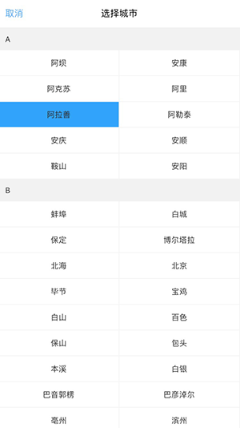

# react-native-city-select
[](https://github.com/ryanyu104/react-native-city-select/blob/master/LICENSE.md)
[](https://www.npmjs.com/package/react-native-city-select)



## Table of contents
- [Install](#install)
- [Usage](#usage)
- [Notice](#notice)
- [Options](#options)
- [Response object](#the-response-object)

## Install

`npm install react-native-city-select@latest --save`

## Usage

```javascript

import React, { Component } from 'react';
import { StyleSheet, Text, View,TouchableOpacity } from 'react-native';
import CitySelect from 'react-native-city-select'
import CITY from './cityData.js'

export default class App extends Component {
  constructor(props) {
    super(props)
    this.state = {
      isVisable: false,
      cityText: '',
      cityId: '',
    }
  }

  handleChangeCityStatus=()=>{
    this.setState({
      isVisable: !this.state.isVisable,
    })
  }

  handleCitySelect=(cityObj)=> {
    this.setState({
      isVisable: false,
      cityText: cityObj.cityName,
      cityId: cityObj.cityId,
    })
  }

  render() {
    return (
      <View style={styles.container}>
        <TouchableOpacity
          onPress={this.handleChangeCityStatus}
        >
          <Text>
            click me!
          </Text>
        </TouchableOpacity>
        <Text>
          {this.state.cityText}{this.state.cityId}
        </Text>
        <CitySelect
          isVisable={this.state.isVisable}
          cancelCity={this.handleChangeCityStatus}
          selectCity={this.handleCitySelect}
          cityData={CITY}
          selectedId={this.state.cityId}
          cityGrid={2}
        />
      </View>
    )
  }
}

const styles = StyleSheet.create({
  container: {
    flex:1,
    justifyContent:'center',
    alignItems:'center'
  },
});


```

### Notice

<b>Position:</b> Put the CitySelect component at the bottom of the container, to avoid hierarchical relation problem.

<b>City data:</b> Get the data of Chinese cities, [click here](https://github.com/ryanyu104/react-native-city-select/blob/master/cityData.js)


```javascript

  const CITY = {
    A: [
      {
        cityId: '279',
        cityName: '阿坝',
        cityNameEn: 'Aba',
      },
      {
        cityId: '329',
        cityName: '安康',
        cityNameEn: 'Ankang',
      },
      ...
    ],
    ...
  }

```


### Options

Key | Type | Defalut
------ | ---- |  ----
cancelCity | function | null
cancelColor | string | '#51a8fb'
cancelSize | number | 14
selectedBg | string | '#26A1FD'
selectedId | string | ''
selectCity | function | null
cityData | object | null
cancelText | string | '取消'
titleText | string | '选择城市'
hasHeader | boolean | true
cityGrid | number | 1


### The Response Object

key | Type
------  | ----------------------
cityObj | Object

